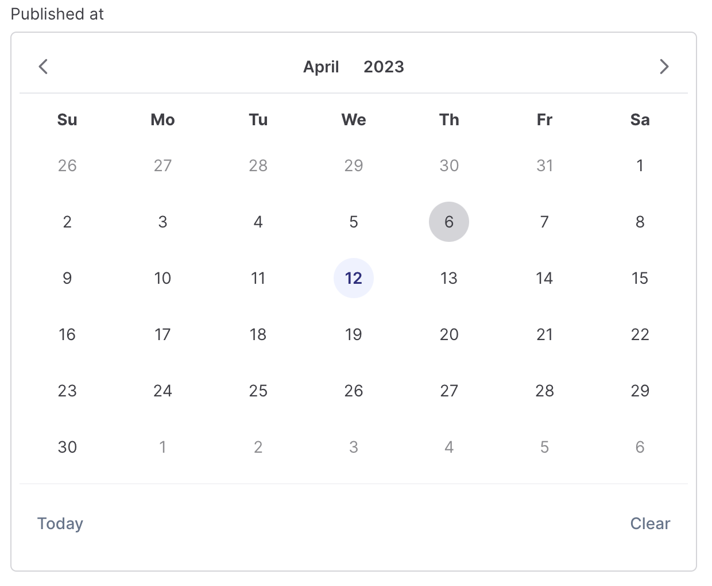

# DateTimeField

## Date-time picker

The date-time picker provides an interactive interface for selecting a date and a time.

```csharp
Make<GridLayout>(new List<IFormComponent>()
        {
            Make<DateTimeField>("published_at")
                .SetShowTime(true),
            
            Make<DateTimeField>("published_at"),
            
            Make<DateTimeField>("published_at")
                .SetTimeOnly(true),
        }),
```


## DateTime restrictions

You may restrict the minimum and maximum date that can be selected with the picker. The `SetMinDate()` and `SetMaxDate()` methods accept a `DateTime` instance:

```csharp
Make<DateTimeField>("published_at")
    .SetMaxDate(DateTime.Now)
    .SetMinDate(DateTime.Now.AddYears(-1))
```

## Format

Default date format is `mm/dd/yy` which can be customized using the `SetDateFormat` method. any of this [Options](https://primereact.org/calendar/#format) can be a part of the format.

```csharp
Make<DateTimeField>("published_at")
    .SetDateFormat("dd/mm/yy")
```

## Icon
An additional icon is displayed next to the input field when `SetShowIcon` is set:

```csharp
Make<DateTimeField>("published_at")
    .SetShowIcon(true, iconPos: "left") // left or right
```

## Multiple

In order to choose multiple dates, use `MultipleDateTimeField`. the value binding should be an array joined by `,`.

```csharp
Make<MultipleDateTimeField>("published_at")
    .SetShowTime()
```

## Range
A range of dates can be selected by using `RangeDateTimeField`, in this case the bound value would be an array with two values where first date is the start of the range and second date is the end, joined by `,`.

```csharp
Make<RangeDateTimeField>("published_at")
    .SetShowTime()
```

## Time
A time picker is displayed when `SetShowTime` is called where 12/24 hour format is configured with `SetHourFormat` method. In case, only time needs to be selected, call `SetTimeOnly()` to hide the date section.

```csharp
Make<RangeDateTimeField>("published_at")
    .SetShowTime()
    
Make<RangeDateTimeField>("published_at")
    .SetHourFormat(HourFormatTypes.AmPm)
    
Make<RangeDateTimeField>("published_at")
    .SetTimeOnly()
```

## Month Picker
Month only picker is enabled by specifying view as `ViewTypes.Month` in addition to a suitable dateFormat.

```csharp
Make<DateTimeField>("release_month")
    .SetLabel("Month")
    .SetView(ViewTypes.Month) // by default format is "mm/yy"
    .SetDateFormat("yy/mm") // override the format
```

## Year Picker
Year only picker is enabled by specifying view as `ViewTypes.Year` in addition to a suitable dateFormat.

```csharp
Make<DateTimeField>("release_year")
    .SetLabel("Year")
    .SetView(ViewTypes.Year) // by default format is "yy"
    .SetDateFormat("yyy") // override the format
```

## Inline
Calendar is displayed as a popup by default, call `SetAsInline` method to customize this behavior.

```csharp
Make<RangeDateTimeField>("published_at")
    .SetAsInline()
```
