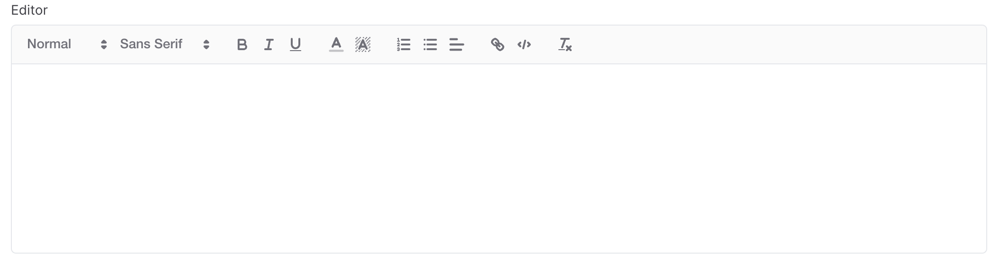
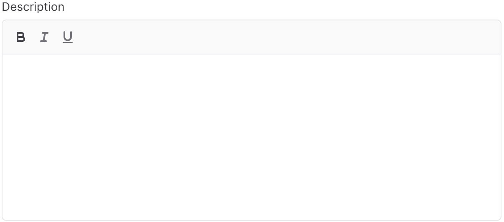

# EditorField

The `EditorField` allows you to edit and preview HTML content.

> [!NOTE]
> Editor uses [Quill](https://quilljs.com/) editor underneath

```csharp
Make<EditorField>("editor")
```



## Toolbar buttons

You can control the toolbar buttons , by calling `SetHeaderButtons` and pass the button classes.

```csharp
Make<EditorField>("description")
    .SetHeaderButtons("ql-bold", "ql-italic", "ql-underline")
```

