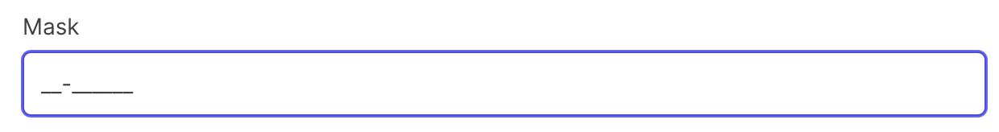
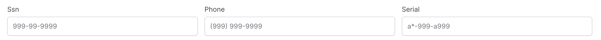

# MaskField

InputMask component is used to enter input in a certain format such as numeric, date, currency, email and phone.


## Basic

You may define the input mask by using `SetInputMask` method.

```csharp
Make<MaskField>("mask")
    .SetInputMask("99-999999")
    .SetPlaceholder("99-999999")
```


## Mask
Mask format can be a combination of the following definitions; `a` for alphabetic characters, `9` for numeric characters and `*` for alphanumeric characters. In addition, formatting characters like `(` , `)` , `-` are also accepted.

```csharp
Make<MaskField>("ssn")
    .SetInputMask("999-99-9999")
    .SetPlaceholder("999-99-9999"),

Make<MaskField>("phone")
    .SetInputMask("(999) 999-9999")
    .SetPlaceholder("(999) 999-9999"),

Make<MaskField>("serial")
    .SetInputMask("a*-999-a999")
    .SetPlaceholder("a*-999-a999"),
```


## Slot Char
Default placeholder for a mask is underscore that can be customized using `slotChar` parameter.

```csharp
Make<MaskField>("mask")
    .SetInputMask("99/99/9999", '/')
```

## AutoClear

When the input does not complete the mask definition, it is not cleared by default. Use `autoClear` parameter to control this behavior. In addition, `?` is used to mark anything after the question mark optional.

```csharp
Make<MaskField>("mask")
    .SetInputMask("(999) 999-9999? x99999", '-', true)
    .SetPlaceholder("(999) 999-9999? x99999"),
```