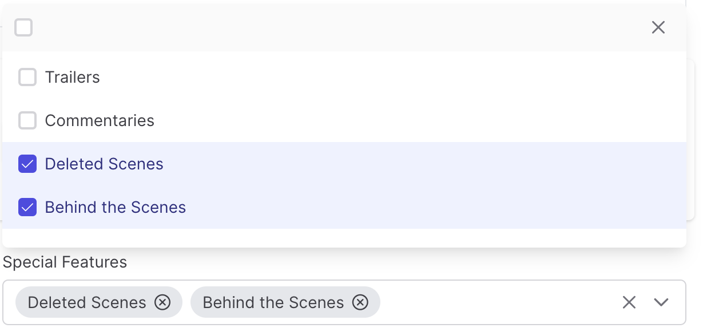

# MultipleSelectField

> [!TIP]
> `MultipleSelectField` inherits all `SelectField` functionalities.

The `MultipleSelectField` component allows you to select multiple values from the list of options:

```csharp
Make<MultipleSelectField>("special_features")
    .SetOptions(new List<KeyValuePair<string, string>>
    {
            //key       //value
        new("Trailers", "Trailers"), 
        new("Commentaries", "Commentaries"),
        new("Deleted Scenes", "Deleted Scenes"), 
        new("Behind the Scenes", "Behind the Scenes")
    })
```


> [!NOTE]
> These options are returned in array format. and saved as a string joined by `,`

## Chips

Selected values are displayed as a comma separated list by default, setting `showAsChips` parameter displays them as chips.

```csharp
Make<MultipleSelectField>("special_features", true)
    .SetOptions(new List<KeyValuePair<string, string>>
    {
            //key       //value
        new("Trailers", "Trailers"), 
        new("Commentaries", "Commentaries"),
        new("Deleted Scenes", "Deleted Scenes"), 
        new("Behind the Scenes", "Behind the Scenes")
    })
```
