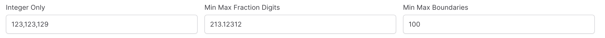
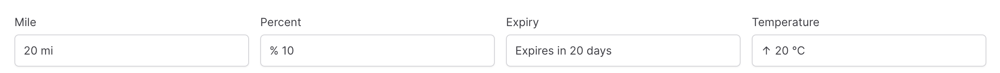

# NumberField

`NumberField` is an input component to provide numerical input.

```csharp
Make<NumberField<int>>("integer only"),
Make<NumberField<decimal>>("Min-Max Fraction Digits")
    .SetMinFractionDigits(2)
    .SetMaxFractionDigits(5),
Make<NumberField<decimal>>("Min-Max Boundaries")
    .SetMin(0)
    .SetMax(100)
```



## Currency

Monetary values are enabled by calling `SetCurrency()` with the currency, currency parameter needs to be defined using ISO 4217 standard such as "USD" for the US dollar.
```csharp
Make<NumberField<decimal>>("rental_rate")
    .SetMinFractionDigits(2)
    .SetCurrency("USD")
```

## Prefix & Suffix

Custom texts e.g. units can be placed before or after the input section with calling `SetInputPrefix` and `SetInputSuffix` methods.

```csharp
Make<NumberField<int>>("mile")
    .SetInputSuffix(" mi"),
    
Make<NumberField<int>>("percent")
    .SetInputPrefix("% "),
    
Make<NumberField<int>>("Expiry")
    .SetInputPrefix("Expires in ")
    .SetInputSuffix(" days"),
    
Make<NumberField<int>>("Temperature")
    .SetInputPrefix("↑ ")
    .SetInputSuffix(" ℃")
    .SetMin(0)
    .SetMax(40)
```


## Buttons

Spinner buttons are enabled using the `SetShowButtons` method and layout is defined with the `buttonLayout` paramter.

```csharp
Make<NumberField<int>>("mile")
    .SetInputSuffix(" mi")
    .SetShowButtons(true, ButtonLayoutTypes.Stacked),
```