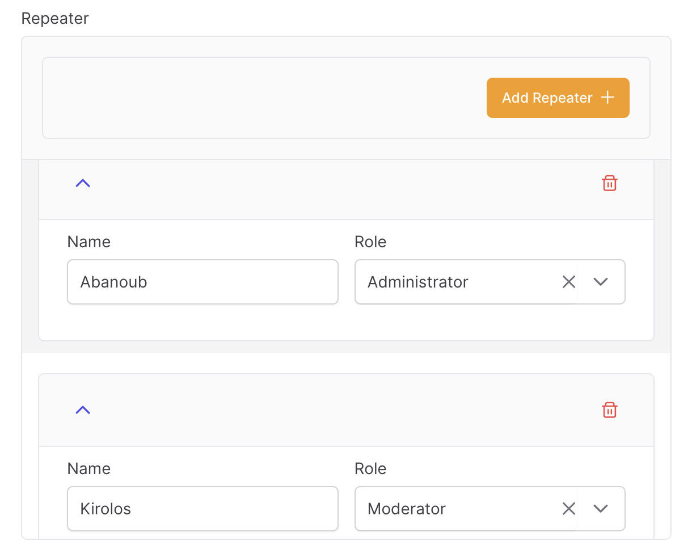
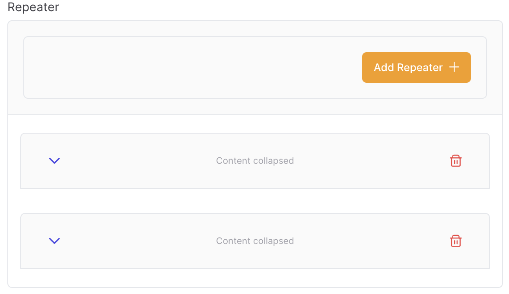

# RepeaterField

The repeater field allows you to output a JSON array of repeated form components.

```csharp
Make<RepeaterField>("repeater")
        .SetSchema(new List<IFormComponent>
        {
            Make<TextField>("name"),
            Make<SelectField>("role")
                .SetOptions(new List<KeyValuePair<string, string>>()
                {
                    new("admin", "Administrator"),
                    new("mod", "Moderator"),
                    new("user", "User")
                })
        })
```



> [!TIP]
> It's recommended that you store repeater data with a `JSON` column in your database.

## Collapsible

The repeater may be collapsible to optionally hide content in long forms:

```csharp
Make<RepeaterField>("repeater")
        .SetSchema(new List<IFormComponent>
        {
            Make<TextField>("name"),
            Make<SelectField>("role")
                .SetOptions(new List<KeyValuePair<string, string>>()
                {
                    new("admin", "Administrator"),
                    new("mod", "Moderator"),
                    new("user", "User")
                })
        })
        .SetAsCollapsible()
```



## Authorization

You may also control the user:- adding items, deleting items, or moving items inside the repeater

```csharp
Make<RepeaterField>("repeater")
        .SetSchema(new List<IFormComponent>
        {
            Make<TextField>("name"),
            Make<SelectField>("role")
                .SetOptions(new List<KeyValuePair<string, string>>()
                {
                    new("admin", "Administrator"),
                    new("mod", "Moderator"),
                    new("user", "User")
                })
        })
        // only admins can control the repeater
        .SetCanMoveItem(User.IsTrinityAdmin())
        .SetCanDeleteItem(User.IsTrinityAdmin())
        .SetCanCreateItem(User.IsTrinityAdmin())
```