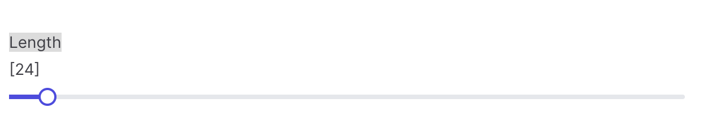

# SliderField

`SliderField` is a component to provide input with a drag handle.

## Basic

```csharp 
Make<SliderField>("length")
```

## Step

Size of each movement is defined with the `SetStep` method.

```csharp 
Make<SliderField>("length")
    .SetStep(20)
```

## Min/Max

You can control the min value and max value using, `SetMin` , `SetMax`

```csharp 
Make<SliderField>("length")
    .SetMin(20)
    .SetMax(90)
```

## Orientation

Default layout of slider is horizontal, use `SetSetOrientation` method for the alternative vertical mode.

```csharp
Make<SliderField>("length")
    .SetOrientation(OrientationType.Vertical)
```

