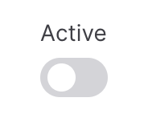

# SwitchInputField

`SwitchInputField` is used to select a boolean value.

```csharp
Make<SwitchInputField>("active")
```



## Preselection

To set an initial value you can use `SetDefaultValue` method.

```csharp
Make<SwitchInputField>("active")
    .SetDefaultValue(true)
```


## Customizing the boolean values

You may customize what value is true and what value is false.

```csharp
Make<SwitchInputField>("is_featured")
    .SetTrueValue("cool")
    .SetFalseValue("bad")
```