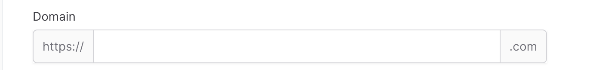

# Forms

Resource classes contain a [TrinityForm](~/api/AbanoubNassem.Trinity.Components.TrinityForm.yml) property that is used
to build the form on the create and update pages.

```csharp
protected override TrinityForm GetTrinityForm()
    {
        return Make<TrinityForm>()
            .SetSchema(new List<IFormComponent>
            {
                // fields
            });
    }
```

## Fields

The `TrinityForm.SetSchema` method is used to define the schema of your form. It is a list of layouts and fields, in the
order they should appear in your form.

`Trinity` has many fields available for your forms, including:

- [BelongsToField](./fields/belongs-to-field.md)
- [DateTimeField](./fields/dateTime-field.md)
- [EditorField](./fields/editor-field.md)
- [FileUploadField](./fields/file-upload-field.md)
- [MaskField](./fields/mask-field.md)
- [SelectField](./fields/select-field.md)
- [MultipleSelectField](./fields/multiple-select-field.md)
- [NumberField](./fields/number-field.md)
- [SliderField](./fields/slider-field.md)
- [RangeSliderField](./fields/range-slider-field.md)
- [RepeaterField](./fields/repeater-field.md)
- [SwitchInputField](./fields/switch-input-field.md)
- [TextAreaField](./fields/text-area-field.md)
- [TextField](./fields/text-field.md)

You may also build your own completely custom form fields.

> [!NOTE]
> Fields may be created using the resource/page `Make<>` method, passing to it the name of the column, followed by any arguments the field requires.

## Setting a label

By default, the label of the field will be automatically determined based on its name. To override the field's label,
you may use the `SetLabel()` method. Customizing the label in this way is useful.

```csharp
Make<DateTimeField>("release_year")
    .SetLabel("Year")
```

## Setting an ID

In the same way as labels, field IDs are also automatically determined. To override a field ID, use the `SetId()`
method:

```csharp
Make<DateTimeField>("release_year")
    .SetId("Year-Id")
```

## Setting a default value

Fields may have a default value. To define a default value, use the `SetDefault()` method:

```csharp
Make<SwitchInputField>("active")
    .SetDefaultValue(true)
```

> [!NOTE]
> This only works on Create Pages, as Edit/Update Pages will always fill the data from the database record.

## Helper messages and tooltips

Sometimes, you may wish to provide extra information for the user of the form. For this purpose, you may use helper
messages and tooltips.

Help messages are displayed below the field.

```csharp
Make<TextField>("first_name")
    .SetHelperText("This where you enter your first name!")
```

Tooltips can be used to display text above the field when selected:

```csharp
Make<TextField>("last_name")
    .SetTooltip("This where you enter your last name!"),
```

## Custom attributes

The HTML attributes of the field's wrapper can be customized by passing an array of `SetExtraAttributes()`:

```csharp
Make<TextField>("first_name")
    .SetExtraAttributes(new Dictionary<string, string>()
    {
        { "class", "bg-gray-200" }
    })
```

To add additional HTML attributes to the input itself, use `SetExtraInputAttributes()`:

```csharp
Make<TextField>("first_name")
    .SetExtraInputAttributes(new Dictionary<string, string>()
    {
        { "class", "bg-gray-200" }
    })
```

## Disabling

You may disable a field to prevent it from being edited:

```csharp
Make<TextField>("first_name")
    .SetAsDisabled()
```

Optionally, you may pass a boolean value to control if the field should be disabled or not:

```csharp
Make<TextField>("first_name")
    .SetAsDisabled(!User.IsTrinityAdmin())
```

> [!CAUTION]
> Please note that disabling a field does not prevent it from being saved, and a skillful user could manipulate the HTML
> of the page and alter its value.

To prevent a field from being saved, use the `SetIsSavable(false)` method:

```csharp
Make<TextField>("first_name")
    .SetAsDisabled()
    .SetIsSavable(false)
```

### Hiding

You may hide a field:

```csharp
Make<TextField>("first_name")
    .SetAsHidden()
```

Optionally, you may pass a boolean value to control if the field should be hidden or not:

```csharp
Make<TextField>("first_name")
    .SetAsHidden(!User.IsTrinityAdmin())
```

## Setting a placeholder

Many fields will also include a placeholder value for when it has no value. You may customize this using
the `SetPlaceholder()` method:

```csharp
Make<TextField>("first_name")
    .SetPlaceholder("Doe")
```

## Setting html input type

You may use the `SetInputType()` method to pass
another [HTML input type](https://developer.mozilla.org/en-US/docs/Web/HTML/Element/input#input_types):

```csharp
Make<TextField>("email")
    .SetInputType("email")
```

## Required

You may set the field as required which will show a red asterisk (*) next to the label:

> [!NOTE]
> This will only add the HTML validation, not actually checking it on the server.

```csharp
Make<TextField>("first_name")
    .SetAsRequired()
```

## Affixes

You may place text before and after the input using the `SetPrefixes()` and `SetSuffixes()` methods:

```csharp
Make<TextField>("domain")
    .SetLabel("Domain")
    .SetPrefixes("https://")
    .SetSuffixes(".com")
```



You may place a icon before and after the input using the `SetPrefixIcons()` and `SetSuffixIcons()` methods:

```csharp
Make<TextField>("domain")
    .SetLabel("Domain")
    .SetPrefixIcons("pi pi-link")
    .SetPrefixes("https://")
    .SetSuffixIcons("pi pi-globe")
    .SetSuffixes(".com")
```

