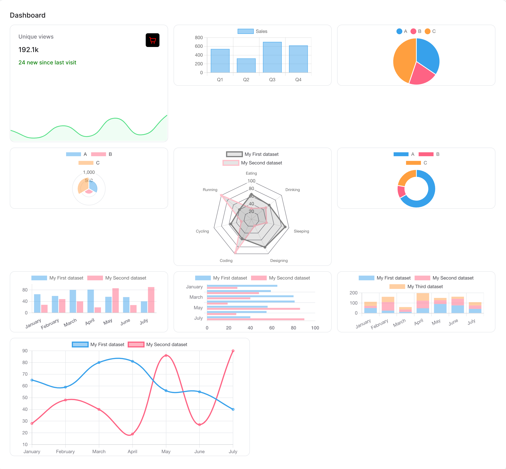

# Chart Widgets

`Trinity` comes with many "chart" widget template, which you can use to display real-time, interactive charts.

## Available chart types

You may use any of the [Available Widgets](~/api/AbanoubNassem.Trinity.Widgets.yml). and you may check their corresponding [PrimeReact](https://primereact.org/chart/#basic) documentation page.

```csharp
protected override List<ITrinityWidget> GetSchema()
{
    return new List<ITrinityWidget>()
    {
        Make<StatsWidget>("Unique views", "192.1k")
            .SetIcon("pi pi-shopping-cart", "red", "black")
            .SetDescription("24 new since last visit", "green")
            .SetChart(7, 2, 10, 3, 15, 4, 17)
            .SetHeight("300px"),
            
        Make<BarChartWidget>()
            .SetLabel("Sales")
            .SetChart(("Q1", 540), ("Q2", 325), ("Q3", 702), ("Q4", 620)),
        
        Make<PieChartWidget>()
            .SetChart(("A", 540), ("B", 325), ("C", 702))
            .SetHoverBackgroundColor("black", "green", "yellow"),
        
        Make<PolarAreaChartWidget>()
            .SetChart(("A", 540), ("B", 325), ("C", 702)),
        
        Make<RadarChartWidget>()
            .SetLabels("Eating", "Drinking", "Sleeping", "Designing", "Coding", "Cycling", "Running")
            .SetDataset(new List<object>() { 65, 59, 90, 81, 56, 55, 40 }, "My First dataset", "gray", "gray",
                "gray", "gray")
            .SetDataset(new List<object>() { 28, 48, 40, 19, 96, 27, 100 }, "My Second dataset", "pink", "pink",
                "pink", "pink")
            .SetHeight("300px"),
       
        Make<DoughnutChartWidget>()
            .SetChart(("A", 300), ("B", 50), ("C", 100))
            .SetHoverBackgroundColor("black", "green", "yellow"),
       
        Make<VerticalBarChartWidget>()
            .SetLabels("January", "February", "March", "April", "May", "June", "July")
            .SetDataset(new List<object>() { 65, 59, 80, 81, 56, 55, 40 }, "My First dataset")
            .SetDataset(new List<object>() { 28, 48, 40, 19, 86, 27, 90 }, "My Second dataset"),
        
        Make<HorizontalBarChartWidget>()
            .SetLabels("January", "February", "March", "April", "May", "June", "July")
            .SetDataset(new List<object>() { 65, 59, 80, 81, 56, 55, 40 }, "My First dataset")
            .SetDataset(new List<object>() { 28, 48, 40, 19, 86, 27, 90 }, "My Second dataset"),
       
        Make<StackedBarChartWidget>()
            .SetLabels("January", "February", "March", "April", "May", "June", "July")
            .SetDataset(new List<object>() { 50, 25, 12, 48, 90, 76, 42 }, "My First dataset")
            .SetDataset(new List<object>() { 21, 84, 24, 75, 37, 65, 34 }, "My Second dataset")
            .SetDataset(new List<object>() { 41, 52, 24, 74, 23, 21, 32 }, "My Third dataset"),
       
        Make<LineChartWidget>()
            .SetLabels("January", "February", "March", "April", "May", "June", "July")
            .SetDataset(new List<object>() { 65, 59, 80, 81, 56, 55, 40 }, "My First dataset")
            .SetDataset(new List<object>() { 28, 48, 40, 19, 86, 27, 90 }, "My Second dataset")
            .SetColumnSpan(6)
            .SetHeight("300px")
    };
}
```



