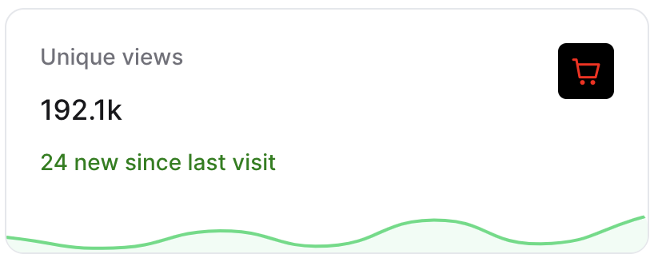

# StatsWidget

`Trinity` comes with a "stats overview" widget template, which you can use to display a number of different stats in a single widget, without needing to write a custom view.

```csharp
Make<StatsWidget>("Unique views", "192.1k")
```

## Card descriptions and icons

You may  `SetDescription()` to provide additional information, along with `SetIcon()`:

```csharp
Make<StatsWidget>("Unique views", "192.1k")
    .SetDescription("24 new since last visit")
    .SetIcon("pi pi-shopping-cart")    
```

## Colors

You may also give description and icon colors:

```csharp
Make<StatsWidget>("Unique views", "192.1k")
    .SetDescription(
        description: "24 new since last visit", 
        color: "green"
     )
    .SetIcon(
        icon:  "pi pi-shopping-cart",
        color: "red", 
        backgroundColor: "black"
    )
```

## Charts

You may also `SetChart` to each card to provide historical data. The `SetChart()` method accepts an array of data points to plot:

```csharp
Make<StatsWidget>("Unique views", "192.1k")
    .SetIcon("pi pi-shopping-cart", "red", "black")
    .SetDescription("24 new since last visit", "green")
    .SetChart(7, 2, 10, 3, 15, 4, 24)
    .SetChartBackgroundColor("rgb(240 253 244)") //the default
    .SetChartBorderColor("rgb(74 222 128)") //the default
```



> [!TIP]
> You can use any CSS color you like, to represent the state of your chart.